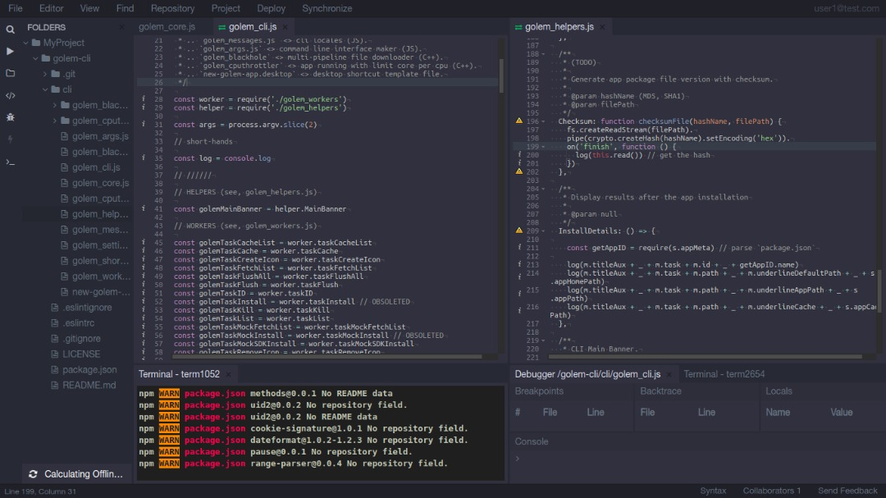

# monolith (alpha) 0.8.3

<p align="left">
  
</p>

All-purpose cloud IDE packed with peer environment, linters, debuggers, compilers, terminal, git, offline-env, etc.

**Recommended** to use the Docker container application.

# docker

get the container,

```bash
$ docker pull loouislow81/monolith-alpha:latest
```

run the container,

```bash
$ docker run -it -p 8787:8787 -v /path/to/your/project/folder:/opt/monolith/workspace loouislow81/monolith-alpha:latest
```

run the container at background,

```bash
$ docker run -it -d -p 8787:8787 -v /path/to/your/project/folder:/opt/monolith/workspace loouislow81/monolith-alpha:latest
```

# usage

on your web browser, enter this IP Block **http://youripaddress:8787**

predefined test user login and password,

- user1 (user1@test.com, user1)
- user2 (user2@test.com, user2)
- user3 (user3@test.com, user3)
- user4 (user4@test.com, user4)
- user5 (user5@test.com, user5)

to add more or change the predefined user accounts, you will need to edit `run-stack.conf` file. As for Docker container application, you will need to recompile yourself a new container with the `Dockerfile` provided.

Enjoy!

---

MIT License

Copyright (c) 2016 Loouis Low

Permission is hereby granted, free of charge, to any person obtaining a copy
of this software and associated documentation files (the "Software"), to deal
in the Software without restriction, including without limitation the rights
to use, copy, modify, merge, publish, distribute, sublicense, and/or sell
copies of the Software, and to permit persons to whom the Software is
furnished to do so, subject to the following conditions:

The above copyright notice and this permission notice shall be included in all
copies or substantial portions of the Software.

THE SOFTWARE IS PROVIDED "AS IS", WITHOUT WARRANTY OF ANY KIND, EXPRESS OR
IMPLIED, INCLUDING BUT NOT LIMITED TO THE WARRANTIES OF MERCHANTABILITY,
FITNESS FOR A PARTICULAR PURPOSE AND NONINFRINGEMENT. IN NO EVENT SHALL THE
AUTHORS OR COPYRIGHT HOLDERS BE LIABLE FOR ANY CLAIM, DAMAGES OR OTHER
LIABILITY, WHETHER IN AN ACTION OF CONTRACT, TORT OR OTHERWISE, ARISING FROM,
OUT OF OR IN CONNECTION WITH THE SOFTWARE OR THE USE OR OTHER DEALINGS IN THE
SOFTWARE.
